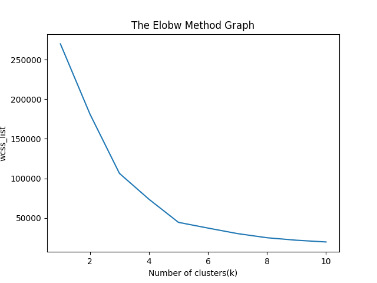
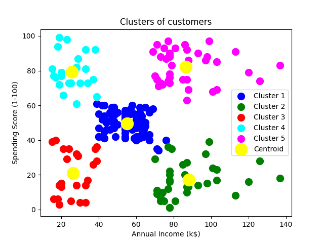

# Artificial Intelligence of Control Systems in Aircraft and Moving Vehicles

## **Andrii Popovych** СУ-402Ба Laboratory work №4

## About Laboratory Work

Through this lab, we have studied the K-NEAREST NEIGHBOR (KNN) algorithm for machine learning, its main advantages and disadvantages, how the algorithm works.

### **Types of Decision Trees**

- K-Nearest Neighbor is one of the simplest Machine Learning algorithms based on Supervised Learning technique.
- K-NN algorithm assumes the similarity between the new case/data and available the new case into the category that is most similar to the available categories.
- K-NN algorithm stores all the available data and classifies a new data point based on the similarity. This means when new data appears then it can be easily clas category by using K- NN algorithm.
- K-NN algorithm can be used for Regression as well as for Classification but mostly it is used for the Classification problems.
- K-NN is a non-parametric algorithm, which means it does not make any underlying data.
- It is also called a “lazy learner immediately instead it stores the dataset and at the time of classification, it performs an action on the dataset.
- KNN algorithm at the training phase just stores the dataset and when it gets new data, then it classifies that data into a category that is much similar to the new data.

### **How does K-NN work?**

- **Step-1:** Select the number K of the neighbors
- **Step-2:** Calculate the Euclidean distance of K number of neighbors
- **Step-3:** Take the K nearest neighbors as per the calculated Euclidean distance.
- **Step-4:** Among these k neighbors, count the number
- **Step-5:** Assign the new data points to that category for which the number of the neighbor is maximum.
- **Step-6:** Our model is ready.

### **How to select the value of K in the K-NN Algorithm?**

Below are some points to remember while selecting the value of K in the K-NN algorithm:

- There is no particular way to determine the best value for "K", so we need to try some values to find the best out of them. The most preferred value for K is 5.
- A very low value for K such as K=1 or K=2, can be noisy and lead to the effects of outliers in the model.
- Large values for K are good, but it may find some difficulties.
- Also it is possible to use K=sqrt(n), where n is a total number of data points (if in case n is even we have to make the value odd by adding 1 or subtracting 1 that helps in select better).

### **Advantages of KNN Algorithm:**

- It is simple to implement.
- It is robust to the noisy training data.
- It can be more effective if the training data is large.

### **Disadvantages of KNN Algorithm:**

- Always needs to determine the value of K which may be complex some time.
- The computation cost is high because of calculating the distance between the data points for all the training samples.

## Installing and execute

Install python3 and pip3 (if not exists)

```bash
sudo apt update
sudo apt install python3
sudo apt install python3-pip
```

Check if python3 and pip3 installed: ```python3 -V && pip3 -V```

If everything is installed correctly, you should see something similar to this:

```bash
Python 3.10.6
pip 22.0.2 from /usr/lib/python3/dist-packages/pip (python 3.10)
```

Next, you need to download the repository, install all the necessary libraries and run the script.
To do this, use the following commands:

```bash
git clone https://github.com/yope-dev/lw4.git
cd lw4
pip3 install -r requirements.txt
python3 main.py
```

## Results

### The Elobw Method Graph



### Clusters of customers



## Project structure

| File Name        | Description                           |
|------------------|---------------------------------------|
| main.py          | The main script of the project.       |
| requirements.txt | Required libraries and their versions.|
| Mall_Customers_data.csv         | Dataset.                              |
| ./images/          | Folder for all images.                |
| Readme.md        | Project description file.             |
